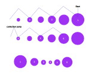

# toc
1. [intro](#intro)
2. [context](#content)
3. [terms/names](#termsnames)
4. [tree building steps](#tree-building-steps)
   1. [creating the raw breeding tree](#creating-the-raw-breeding-tree)
   2. [creating a structure for visualization](#creating-a-structure-for-visualization)
   3. [translating it into usable data exchange format](#translating-it-into-usable-data-exchange-format)
5. [frontend](#frontend)
   1. [form](#form)
   2. [leaflet](#leaflet)
6. [external data and manual data folder](#external-data-and-manual-data-folder)
7. [external json schemes](#external-json-schemes)
8. [exec path](#exec-path-folder)
9. [exceptions](#exceptions-folder)
10. [top level classes in the includes folder](#top-level-classes-in-the-includes-folder)
11. [output messages](#output-messages-folder)

# intro
This documentation is primarily intended to explain how this special page works and make it far easier for you to change this software. It's not meant as usage/setup documentation. It's also not meant as a complete standalone definition of this specialpage, meaning it explains the algorithms and design choices but generally not the concrete code. At some points this maybe went a bit too much from pure explanation to telling the short story how the approach came into being, but the development of an approach increases naturally in complexity and stories in general are easier to read and memorize, so hopefully it's all right.

The BreedingChains specialpage has the goal to display the possible breeding chains for a Pokémon to get a certain move in the most practical way. This also means that the built breeding trees are explicitly *NOT* complete. Often you can have massive chains of breeding, sometimes even infinitely long ones when you manage to build closed loops. For smaller grafics and faster computing this specialpage uses some rules to ignore unnecessarily long breeding paths.

# context
In most Pokémon main games two Pokémon can be put in the Pokémon Nursery and - if some factors apply - get children

These factors are:
* both Pokémon have at least one matching egg group
* one is female, the other one is male

Both Pokémon explicitly do not have to be of the same species.

The children are always of the species of the mother. 

The children can inherit moves from their parents if following factors apply:
* the move is in the breeding learnsets of the child
* one of the parents has the move

This means that often you can get some moves on a Pokémon far earlier, than using ordinary leveling. However, the fact that Pokémon can have up to two egg groups creates another field of possible learnabilities: The so called chain breeding, where you kind of drag moves over multiple Pokémon species.

For example, when you want to get Skull Bash on Bulbasaur in Pokémon Sword. One possible way is: Getting a male Sandaconda that learns Skull Bash on level 1. Pair that with a female Rhyhorn (or one of its evolutions) to get a male Rhyhorn with Skull Bash (a male one is needed for the next step). Pair that with a female Bulbasaur (or one of its evolutions) to get a Bulbasaur with Skull Bash.

The breeding chain with the egg group connections would be:

    Sandaconda =Field=> Rhyhorn =Monster=> Bulbasaur

---

Really understanding the role of the amount of egg groups a Pokémon has, plays a major role in one of the building steps.

If you want to get a move over multiple egg groups, only Pokémon with two groups are suitable for the middle parts. That's because with only one egg group, the Pokémon can only be paired with one single pool of Pokémon. But for chain breeding you want one pool to get the move and one pool to pass on the move. You could of course pair with a Pokémon that has two egg groups and then move on to another group, but then this Pokémon could be paired directly without the detour over our Pokémon with one egg group.

So, generally said, if you cut out all unecessary detours and only want the shortest paths (like we do), in and out or getting and passing on a move each need an egg group. If you only have one, you're only able to receive a move or pass it on to others. Only receiving is done by the top level root. Only passing on is done by the path ends. So at the beginning and end of a chain, the egg group amount doesn't play a big role, but in the middle you have to have two groups.

Examples:

Litwick has one egg group: Amorphous.

An efficient breeding chain could look like this:

    A =Amorphous=> Litwick

But not like this:

    A =Amorphous=> Litwick =...=> B

Because Litwick lacks the egg group for the connection to B.

Why not the following one?

    A =Amorphous=> Litwick =Amorphous=> C

Because this is unnecessarily long and just skipping Litwick is faster and more practicable:

    A =Amorphous=> C


Short conclusion: Pokémon with one egg group are beneficial only at the beginning or the and of a breeding chain. Middle parts of a chain need Pokémon with two egg groups to be able to have two connections (in and out).

## edge cases
### Ditto
When pairing a Pokémon with Ditto, the gender of the Pokémon is irrelevant. This enables male-only and gender-unknown Pokémon to have children of their species.

### egg group unknown
Pokémon in the egg group Unknown (mostly legendaries) can't get children and therefore are irrelevant for this topic. Baby Pokémon are an exception: They can't be paired but breeded.

# terms/names
In the source code the name `successor` appears quite often. This is meant in the context of trees, *NOT* Pokémon breeding. The trees are built with the start on the left side, because then path lengths are aligned in the usual left to right order going from shortest to longest, so a tree successor means a Pokémon parent/predecessor.

`unpairable` means the Pokémon can't be paired with another one and therefore can't get children. Mostly legendaries and baby Pokémon.

`unbreedable` means the Pokémon can't hatch from an egg. Mostly Pokémon that are evolutions.

`learns in old gen` and all of its variations mean learns in old game. Originally the special page separated by game generations, not by games and I never re-adatped to a name with "old game"

(breeding) `path` and (breeding) `chain`. Both mean a list of parents you have to move a move over to get it to your wanted Pokémon.

# tree building steps
The breeding trees are created in three steps.
First the raw structure is calculated. At this point, the possible paths are set.

Then this structure is translated into one that has everything you need for general visualization, i. e. every node has its coordinates and other data (e. g. icon links).

In the last step the visual structure is translated into a concrete and small exchangable format. Currently JSON is used, but in the beginning it was SVG, which should be easy to switch back to again.

---

(little side note about the move from SVG to JSON: at first the grafics were built and displayed as SVGs, but building zooming and moving myself was difficulter than expected and then I heard of leaflet that basically did all of that far better and I switched to it; at first I just used the SVG grafic as a background in leaflet and added some popups and so on via JS, but this was quite tricky because of imo. unintuitive coordinate systems (yes, multiple different ones) of leaflet; so instead of a background I rebuilt the entire grafic in leaflet in JS with the SVG as the basis that was display:noned, but this was quite slow, some extreme cases took about 2s on my PC, so I separated general visualization logic from SVG logic (this would have been generally a todo) and added a JSON translation, changing the exchange format massively boostet performance (these extreme cases were pushed to about 200ms on my PC) and shrinked the data size a lot)

## creating the raw breeding tree
Folder: `includes/tree_creation`

In this building step we look for all shortest successful breeding paths. That is done by trying all possibilities and adding them on success.

First some general thougts:
Just blindly trying everything, will result in infinite recursion, so we need some restricting rules. We want only short paths, so every egg group should only appear once or never per single path, because if it would appear multiple times, we could just remove the connections in between these appearances and still have a working but far shorter path.

We want short paths, so being able to learn the wanted move directly (level up, TMTR or Move Tutors) should end the path, even if the Pokémon could inherit it from others. Breeding aside, we also have learning in an old game and event distributions. The thing with these two is that it can be very hard or even impossible to use them. So I came up with the following system:
* if the Pokémon can learn the move directly, stop and finish this path as a success
* mark if the Pokémon can learn the move in an old gen, but don't do anything more on this learning type
* check if the Pokémon can inherit the move and do this procedure for every possible successor
  *  if at least one path is successful, stop and finish this path as a success
* if the Pokémon can learn the move in an old gen, stop and finish this path as a success
* if the Pokémon can have the move from an event distribution, stop and finish as a success
* reaching this point, means the Pokémon can't learn the move, stop and finish as a failure
This system is not set in stone. Especially the handliung of old gen and event learnability can be discussed. But that's the current state.

This already describes the core recursive algorithm for building the breeding tree.
Here is a pseudocode version:
```
    if learns directly:
        mark learns directly
        return success
    
    if learns in old gen:
        mark learns in old gen
    
    if can inherit:
        mark could inherit
        successors = empty list
        for every possible parent of the current pkmn:
            result = do this procedure with parent
            if result = success
                add parent to successors
        
        if successors has entries:
            mark can inherit
            return success
    
    if learns in old gen:
        return success
    
    if learns in event:
        mark learns in event
        return success
    
    return failure
```

### fighting redundancies
In the beginning there were many visually identical subtrees that bloated the breeding trees and this still happens quite often.
So we have many subtrees that only differ in their roots. It would be very nice if we could have identical part only once and compactly connect the roots to this single piece.

To partly tackle this issue I first created the entire complicated system with subtrees and nodes and the annoying need of fancy grafics to really understand this stuff (at first everything consisted of nice friendly little nodes doing their stuff and no abstract structural things that sometimes do nothing and other times do everything).
I didn't want to give up trees, because graphs would mean so many more unnecessary problems and far far more complex algorithms everywhere. So I decided to cheat a bit on the idea of trees and made trees with a root that actually consists of multiple entities. On the structural layer you have subtrees with one abstract root and many subtree successors, but on the concrete layer you have multiple nodes (in most cases called roots) building the root of the subtree.

One of the main aspects is how to detect identical subtrees efficient. This was the key question that kept this waiting for quite some time until I got the idea that a breeding subtree can be declared not only by its members but also by its factors that determine what selection of Pokémon this subtree starts with and who is not allowed to take part, i. e. its targeted egg group and blacklisted egg groups. The next idea to build hashes from these factors made the idea that just uses all members far more practical, so the previous idea wasn't so crucial anymore, but the start-subtractors concept has an important advantage that is explained very soon.

In general we give every breeding subtree a partly unique hash. If two subtrees have the same hash, their successors are identical -> the subtrees can be fused together, i. e. the root of one tree can be added to the other.

However one problem appears with this: nodes not only have connections to their successors but also to their root. If we wildly fuse subtrees all around the whole structure we'll get a jungle of connections jumping around, crossing other subtrees and a graph like connection chaos that's quite hard to clear.

I solved this problem with the following extremely ingenious und complex algorithm: .... I made sure this never happens. (jokes aside, I tried to solve this with optimazion algorithms that consisted of sorting parts and recalculating optimazion measurements in between each sorting iteration and crazy ideas about a vertical track manager that would coordinate creating the node connections without lines laying on top of each other, but this was such a huge mountain of problems to solve that I decided to make this redundancie tackling a bit weaker while don't having to worry about this very complex problems).

All tree algorithms use the fact that subtrees stay in their subtree and don't affect any subtree that's not part of themselves. Therefore we can use recursion very elegantly and keep the algorithms simple. The main problem with the crazy connection chaos is that we break this separation of subtrees. We can't just move a subtree freely around because it could be connectied to another one. But most redundancies will happen inside a subtree because there many factors deciding what Pokémon are viable options are the same. So, I decided to limit this redundancy avoiding to the borders of a subtree.

This situation is rather simple to implement. When the current node can inherit the targeted move, i. e. could get a tree that doesn't just contain this node and nothing else, we look if its subtree hash already exists. If it does we add the node to the roots of that node and stop, otherwise we continue with the default algorithm (note that this additionally adds some kind of memoization, i. e. a potential performance increase as a side effect). Then all further algorithms that work on the tree structures have to bear multiple roots and we're done.

### classes
#### `BreedingSubtree`
Resembles a subtree with one or more roots and 0 or more successors. This is the most abstract building block of the raw breeding tree structure. Everything from the entire tree to the single path ends is a BreedingSubtree.

But it's only a structural entity. The concrete nodes are BreedingTreeNode instances. BreedingSubtree instances basically enclose them and bring the individual nodes into a tree structure.

BreedingSubtrees however are created by BreedingTreeNodes. It's like the nodes calculate the breeding chains, throw their successors in their BreedingSubtree and then jump themselves into it, forgetting the connections and existing alone until the next building step.


#### `BreedingRootSubtree`
A BreedingSubtree version that is meant for the wanted Pokémon/the root of roots, so the most outer layer of Subtrees. It has exactly one root and 0 or more successors.

#### `BreedingTreeNode`
The concrete nodes that resemble entities in the breeding structure. Almost in all cases a Pokémon, currently also the item Light Ball for the Volt Tackle special case.

These instances execute the recursive breeding chains creation process and then create BreedingSubtrees and move themselves into there.

#### `MiscTreeNode`
Subclass of BreedingTreeNode for non-Pokémon entities.

A little note: When I started this project I basically didn't knew the term "Clean Architecture". At one point I completely rebuilt both the special page and the data set creation because of too heavy structural mistakes (if you want you can poke around in the commit history and find masterpieces like the class BackendHandler :) ). Sadly I read the book Clean Architecture *after* these two rebuildings and in the special page the mistake to stick to the Pokémon context stayed. Then I suddenly needed to add an item and had to remove the Pokémon context influence. There are still some leftovers of that. For that the function `isPkmn` in Constants.php is needed. At some point this will hopefully be removed.

#### `PkmnTreeNode`
Subclass of BreedingTreeNode for Pokémon entities.

#### `PkmnTreeRoot`
Subclass of PkmnTreeNode for the top level root.
This has little changes in the main breeding chains calculation process:
* not one but up to two egg groups are selected for possible successors (this is the only node that only receives but does not pass on the wanted move)
* tries to get the move via its lowest evolution if it's an evolved form
  * for this another PkmnTreeRoot instance is created for the lowest evolution, so in that case you technically have two top level roots

#### `LearnabilityStatus`
Class for setting and getting learnability info with very simple logic for e. g. building a learnability code, where each type is resembled by one char.

#### `SuccessorFilter`
The filter that throws out every unwanted successor in one breeding chains calculation step.
Additionally this is the place where almost all special cases are handled, that can't be abstracted away in the dataset creation (i. e. this took quite a bit of debugging and tears).

It uses the following order of procedures:
* removes Pokémon that don't exist in the selected game
* removes Pokémon that are unpairable (we want suitable parents, so Pokémon that can't be parents are unwanted)
* removes Pokémon if some gender factors apply (more info further below)
* removes Pokémon that have at least one blacklisted egg group (i. e. one that already appeared in the breeding chain)
* if the targeted game is in gen 2-5 all female-only Pokémon are removed, because back then mothers couldn't pass on moves -> irrelevant for breeding chains

The gender specific factors in detail:

If the current Pokémon whose potential parents are filtered, only has male-only or gender-unknown-only evolutions, all Pokémon that are not in its evolution line are removed. This is because such an evo line can't be mixed with others, because children can only be produced with a Ditto. (little todo: currently only the evolutions are checked, not the lowest evo or the basis or whatever, this probably has to be included)

All gender-unknown-only Pokémon that are no evos of the current node Pokémon are removed. These can only get children with Ditto and are therefore bound to their evo line.

All female-only Pokémon that are not an evolution of the current node Pokémon are removed. These can only be the mother and therefore are bound to their evo line.

#### `SuccessorMixer`
A mixer that directly inserts tree entities by adding an entity as a successful successor. This is currently only used for the Volt Tackle special case, where a Light Orb node is inserted.

## creating a structure for visualization
Folder: `includes/visual_creation`

In this step everything needed for general visualization is calculated. Icons are loaded, sub tree widths and coordinates are calculated and successors get ordered.

### loading icons
This step needs by far the most time of the general visualization and in many cases of the entire backend.

Via the MediaWikiServices class the icon file for each node is loaded. Then the file url is extracted from that data and set in the visual preparation instance.

### calculating subtree heights
Here "height" means the height in our rotated visual scenario. Technically it's the width of a tree.

Each subtree calculates the heights of its roots and its subtree successors and takes the greater one as its own height.

The roots' heigh and successors' height are calculated by adding the individual heights together.

Long story short: Each subtree recursively calculates its height + the extra addition for our special subtrees with multiple roots.

### ordering successors
It's more handier for users to have the shortest paths closest to their viewpoints. To manage that, the successors of each subtree are ordered by height, with the smaller the closer to the middle.

Subtrees with 1 or no successors are skipped in this step.

First the successors are ordered by height ascending.

For the next step we have to react to an even or uneven amount of successors at some point. I chose to do this right at the beginning to keep the loop later on smaller.

With an even amount the second last successor index is taken, otherwise the last one, so we start at the end of the list.

Now we hop to the start with 2 indices per jump and add each encountered successor to our new successor list.
Because of our index selection at the start we always end up at index -1. Here we do a little correcting step to index 0 (add this successor to the list) and then hop in opposite direction, to the end, again with 2 indices per jump and add each encountered successor to the new list.

After that we have a sorted as wanted list of successors.



### calculating y coordinates
The y coordinates like most algorithms in this step are calculated recursively.

Each subtree gets an vertical offset as a parameter which is basically the vertical starting point of this subtree (the y coordinate at which the highest/lowest node will appear).

First: Single roots calculate it like it's shown in this neat grafic:

This is btw. the general calculation pattern used here for getting y coordinates of centered objects.

Then: Each successor subtree calculates its y coordinates recursively. For that an initial offset is calculated. This happens very similiar like the first step, but here imagine that the node in the calculation actually consists of multiple roots. You have to get the sum of the height of multiple entities but after that the calculation is pretty much the same. And then after the first successor, the next offset is just the last one with the height of the last successor on top.

In the end: For multiple roots, we first need the upper and lower borders for our roots. Both the roots and the successors can be the taller part so we have to handle that not always these borders are aquivalent to the highest and lowest point of the subtree.

First, the top: If roots are wider, we just take the original offset, otherwise we take the highest successor's y coordinate.

Then the bottom: Same scheme as with the top: If roots are wider we take the original offset + the roots' height, otherwise the lowest successor's y coordinate.

Then we calculate the starting point of the roots, again with the calculation scheme showed in the grafic above.

and then just calculate each roots y coordinate by adding the last root's height to the last offset.

Little note: This algorithm took several bug fixes to work correctly. If something appears odd about the display of multiple roots of a subtree, the bug is probably somewhere here.

### calculating x coordinates
This is rather simple. Every subtree gets its deepness (how far to the right it is) as a parameter, each root sets its x coordinate by multiplying the deepness with the visual node horizontal margin constant, and then each successor does the same with incremented deepness.

### classes
#### VisualPreparationSubtree
This step uses the same subtree system as the breeding chain calculation. However here most of the logic happens in the subtree while the nodes just give and get values for the calculations.

#### VisualPreparationNode
The node class does everything that doesn't require other nodes. Here the icons are loaded, values are given on demand and new values are taken and set.

The coordinates have three different types: default, middle and bottom.
Default means the upper left corner of the node, the other two mean what their name implies.

## translating it into usable data exchange format
Folder: `includes/visual_creation`

In this step the concrete grafical items for visualization are created. Like lines, circles, icons and so on.

Most of the logic of this step happens in the abstract Visual<Item>.php classes. The JSON and SVG classes just do the last step of converting the finished visual structures in the corresponding formats.

Similiar to the previous one, this build step works mostly on the subtree layer while the nodes get and give values.
First the roots' icons are created. Then the connection/line structure between the current roots and successor is built. Then this is recursively done again for all successors.

In the end the compile method is called on the top level root and the final data structure is recursively created. In this step the circles are created and added. Todo: This is a bit out of place here: It would be more consistent to create them with the icons and lines.

# frontend
## form
The form is built using the OOUI package from MediaWiki. This can be used with JS and php, but its capabilities with php are far smaller and especially far worse documented -> The loading bar is created in the backend so that it instantly appears, the entire form is built in JS.

Little note: Maybe at some point, building the form can be outsourced to the backend. This is one of the two big performance problems (the other one is building the leaflet grafic) and should be solved if possible.

The form has three standard text inputs and three checkboxes for debug outputs that are only displayed for people of the group "voting". They are only hidden, these three options aren't checked again with the user groups anywhere, because I don't see a problem with random users seeing the debug outputs. It's just irrelevant for almost everyone and makes the form bigger.

Every text input updates its warnings on input change. The errors are only set when trying to submit the form.

### game input
The game input has one set of options and updates the other two inputs (i. e. options and errors+warnings) when its input changes.

### Pokémon input
The Pokémon suggestions are dynamically created by filtering out those Pokémon that don't have breeding learnsets in the selected game.
Changing this input updates the move input.

### move input
The move suggestions are the breeding learnsets of the selected Pokémon in the selected game. Changing this input only updates its warnings but nothing else.

### submit button
Currently the submit function only checks for empty fields and sets errors and stops if that's the case. Otherwise it builds the targeted url and opens it in the current tab.

### changes to OOUI
Because the default OOUI would have some critical problems for the specialpage I inserted one method chain and changed two existing methods.
All 3 changes are just little deletions. But still this is very unclean. Maybe these changes can be suggested to the OOUI team at some point.

These changes are added in the `addCustomMethods` function.

#### massive performance increase of setting options
The Pokémon suggestions are updated every time the game input has a new valid value. This means that a few hundred items have to be set.

The first change is that the option objects are created in the form JS itself and directly put into the OOUI core. By doing that they don't have to be created every single time, which is I think quite a big impact on performance because option objects contain multiple document element instances.

However this isn't enough by far. By throwing around some time logging in the OOUI core, I found that two event emits in the final method that actually sets or moves the options have a very heavy performance impact. Because I don't need events that say "this has been added/moved" I just removed these emits, which shortened the needed time for large Pokémon amounts on my PC from about 2s to 200ms.

Little note: When I targeted this problem I didn't manage to do this change asynchronously. However I accidently accomplished it while trying to get something else asynchronous. So should this performance increase break at some point and can't get fixed, it can just get removed and wouldn't cause the original massive problem.

#### custom dropdown button action
By default the text input is automatically selected when clicking the dropdown button. On touch devices this results in tapping the button, the text input is focused, the touch keyboard opens and the dropdown closes -> annoying af, so I just removed the method call that focuses the text input

#### dropdown unwantedly reacting to small heights
The suggestions dropdowns choose a direction (up/down) on their own if the dropdown doesn't fit on the screen with initial zoom. The problem with this is, that on most mobile devices this causes the dropdown to display on top of the text input, directly in the logobar which has a higher z-index -> a large part of the dropdown is unreachable.
To solve this I removed the part that checks whether the dropdown would have enough space and reacts to it, so the dropdown is always displayed in the set direction, even if it would be only one nanometer big.

## leaflet
In the leaflet map creation the map is created and the JSON structure from the last backend build step is run through and based on it the corresponding leaflet elements are created.

The zoom doesn't work by just using mouse wheel events because these have strange differences across browsers. Instead 60px are taken is an estimate for one mouse wheel step. With this estimate and the wanted zoom step size, a wheel pixel amount per zoom level is calculated and set in leaflet.

# external data and manual data folder
To avoid the bottleneck of one or few server administrators in updating the special page, most of the needed data is saved in pages in the MediaWiki namespace in the wiki so that normal administrators can edit them as well. For example when an error is found, this is helpful.

However some few JSON files are stored in the manual_data folder because those will only have to change when new games are released and then the specialpage will have to be updated nonetheless.

# external json schemes
## Pokémon
## egg groups
```ts
interface EggGroups {
    [eggGroupName: string]: string[];
}
```

## Pokémon
Pokémon data is separated in commons for each gen and diffs for each game. In the commons files are properties that don't and won't change across games in a gen, in the diffs files are the properties that do change and might change in the future across games in one gen.
Learnsets are stretched across both file types to shrink file sizes.

```ts
interface Pkmn {
    /**
     * Pokémon number as it's used in PokéWiki
     * e. g. 025 for Pikachu and 025g1 for Giga-Pikachu
     */
    id: string,
    /**
     * the targeted game
     */
    game: string,
    /**
     * whether this Pokémon exists in the targeted game
     */
    exists: boolean,
    /**
     * all property names of the big external JSOn objects are lower case to be able to efficiently ignore character casing of move input 
     * but when the Pokémon name is output to the user, we want the correct casing
     */
    correctlyWrittenName: string,
    /**
     * the base name of the learnset subpage
     * For specialcases this is the name of the normal form
     * todo this can be outsourced to a file in manual_data folder that lists all specialforms and their normal form
     */
    subpageLinkName: string,
    /**
     * first egg group, should always have a non empty string
     */
    eggGroup1: string,
    /**
     * second egg group, if the Pokémon doesn't have one, this is set to ""
     */
    eggGroup2: string,
    gender: 'male' | 'female' | 'both' | 'unknown',
    /**
     * the lowest evolution of the evolution line of this Pokémon
     * e. g. Pikachu would have set "Pichu"
     * 
     * Is needed for evo connections and SuccessorFilter
     */
    lowestEvo: string,
    /**
     * all higher evolutions of this Pokémon
     */
    evolutions: string[],
    /**
     * whether this Pokémon can get children
     */
    unpairable: boolean,
    /**
     * whether this Pokémon can be born directly
     */
    unbreedable: boolean,
    /**
     * level up, TMTR/TMHM and Tutor learnsets
     */
    directLearnsets: string[],
    breedingLearnsets: string[],
    eventLearnsets: string[],
    /**
     * directLearnsets from older games
     */
    oldGenLearnsets: string[],

}
```

# exec path folder
The exec_path folder contains the classes that build the order of actions of the specialpage. It consists of many sections of doing something (tracks) and many sections of checking the current state for an early stop (checkpoints). At first this was done by one long central method in the SpecialBreedingChains class, but I was unhappy with it, so I created this checkpoints and tracks system.

In a track the state of the current execution is changed. For example the constants are initialized or the breeding chains structure is calculated. In a checkpoint the current state is checked for certain states that cause an early finish. For example whether the breeding chains calculation returned an empty tree, meaning the Pokémon can't learn the move, or testing the form inputs for invalid data.

Tracks and checkpoints are connected by a call chain of the passOn method that every part must have. This method contains the basic action and returns a termination code. 
If a checkpoint detects such a special early abort state it reacts to it and returns its own termination code, otherwise it calls the passOn method of the next step and returns the code from this call.

The current order:
1. FormValidationCheckpoint
2. ConstantsInitializationTrack
3. PreDataLoadingCheckPoint
4. EasterEggCheckpoint
5. ExternalDataLoadingTrack
6. PreBreedingTreeCreationCheckpoint
7. BreedingTreeCreationTrack
8. PostBreedingTreeCreationCheckpoint
9. FrontendTreeCreationTrack (just as SVGCreationTrack this name is an inaccurate old leftover)
10. SVGCreationTrack (todo: this name is still a leftover of very old states of the visual structures creation)

# exceptions folder
## AttributeNotFoundException
This exception is thrown in the creation of PkmnData instances if an external JSON object misses a must have property.

## FileNotFoundException
This exception is thrown in the loading of Pokémon icon files when no file could be found. This happens most of the time when a Pokémon icon is missing (e. g. the special page is run on a local server and special form icons are missing).

## InvalidStateException
This exception is thrown when some unintended structure was encountered, like a subtree with multiple roots but no successors (a subtree with a root but no successor is in almost all cases the end of a breeding chain -> the root can learn the move directly -> the step of checking and adding a Pokémon to other subtrees isn't reached -> shouldn't be able to appear). This exception is the newest and very rarely used currently.

# top level classes in the includes folder
## Constants
Has constants and a few little util function that are initialized in the ConstantsInitializationTrack and then used in the entire application.

## HTMLElement
A class first intended as small wrapper around the basic HTML tag building functions of MediaWiki's Html class with added string cleaning for tag contents (Html only has cleaning for opening and ending tags, not the text content/slot) that additionally got some handy functios for HTML tag building and displaying.

## Logger
Group of static functions for logging status, error and warning messages.
These are collected in arrays and get printed after the exec_path parts have finished.

## Pkmn
This class is the most upper abstract class of most node like elements of the trees. Its name is one of the last leftovers of when the trees were focused on Pokémon. Something like "Node" or "TreeNode" would be better (todo)

## SpecialBreedingChains
This is the entry point of this special page. Here everything is started.

It does following things:

1. Sets some constants that only this instance can set (like the constant containing the reference to this instance)
2. sets headers (no idea what actually happens here but this seems like a must have for specialpages)
3. adds loading bar (it would probably be the same if this was done at the and because as it seems the backend just does its things and then the page is loaded and stuff is added to it)
4. adds the form container div
5. starts the exec_path i. e. the special page background magic
6. adds the CSS and JS

# output messages folder
This folder contains classes for basic message boxes. The outputOnce methods were originally needed when the form was built via the HTMLForm class. Currently they are probably unused.